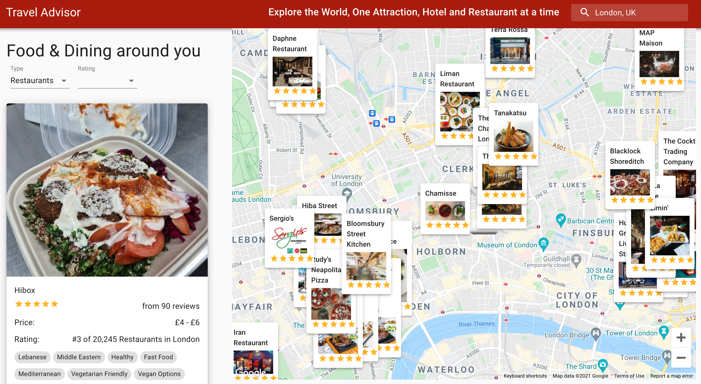
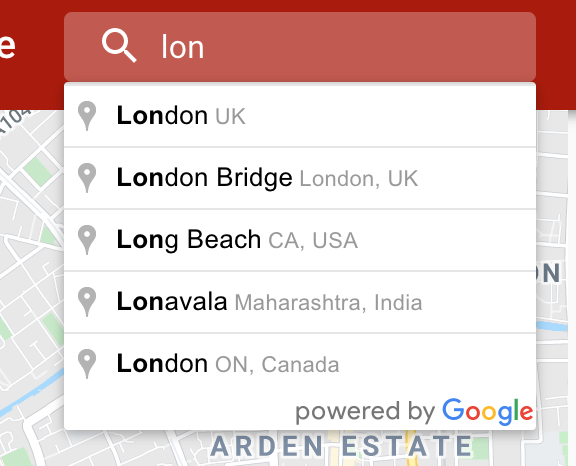
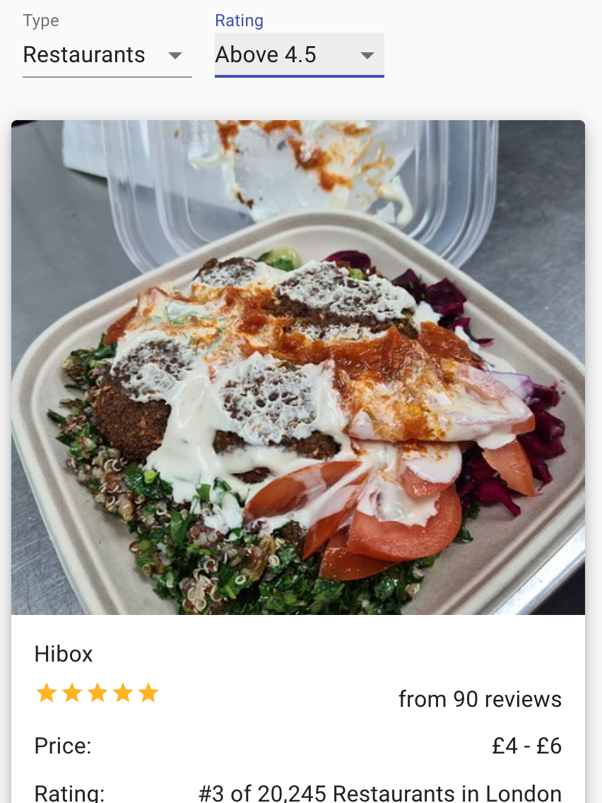

This project was bootstrapped with [Create React App](https://github.com/facebook/create-react-app).

## To run the app

- Input your API keys for google and rapid API as ENV
- input the same google API key as indicated in index.html
- npm i && npm start

# Travel advisor App, Google Maps

Learning to use google maps and the places API for autocomplete in react. Suprisingly easy to do.
This code and app doesnt have soem best practises, the whole thing could ideally do with redux or useContext as I had to lift the state on several occassions but it works and for the purpose of learning which the project was about it is acceptable to me.

